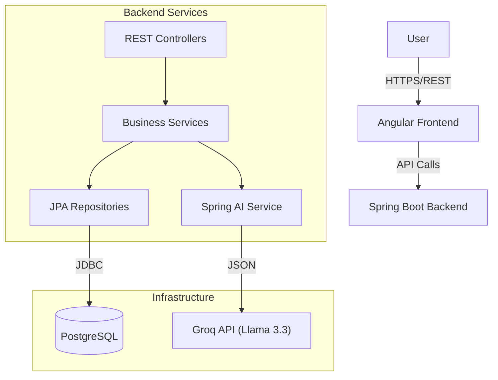

<p align="center">
  <h1 align="center">PlanAI</h1>
  <p align="center">
    <strong>AI-Native Project Planning Assistant</strong>
  </p>
  <p align="center">
    A full-stack application demonstrating modern Backend Engineering & AI Agent Integration.
    <br/>
    <em>Built to showcase robust API design, database modeling, and LLM orchestration.</em>
  </p>
</p>

<p align="center">
  <a href="https://spring.io/projects/spring-boot"></a>
  <a href="https://groq.com"></a>
  <a href="https://openjdk.org/"></a>
  <a href="https://www.postgresql.org/"></a>
  <a href="https://angular.dev/"></a>
  <a href="https://docs.docker.com/compose/"></a>
</p>

---

## 📺 Demo

<!-- REPLACE THE LINK BELOW WITH YOUR VIDEO URL/GIF -->
<div align="center">
  <a href="docs/recording.mp4">
    
  </a>
  <p><em>Watch how PlanAI turns a simple idea into a structured project plan in seconds.</em></p>
</div>

---

## 🎯 Project Context & Goal

**PlanAI** was built with a specific goal: **To demonstrate advanced Backend Engineering capabilities and the practical application of AI Agents in software development.**

As a **Backend Engineer**, my primary focus was on designing a scalable architecture, implementing complex business logic, and integrating Large Language Models (LLMs) to solve real-world problems.

### 🤖 The "AI-Assisted Frontend" Approach
While I possess full-stack understanding, I leveraged **AI Agents** (specifically `PlanAI Agent`) to build the majority of the **Angular 21** frontend. 
*   **Why?** To demonstrate that as a backend specialist, I can effectively orchestrate AI tools to deliver a polished, modern, and responsive UI without getting bogged down in pixel-pushing.
*   **Result:** A fully functional, aesthetically pleasing, and accessible frontend that serves as the perfect interface for my robust backend logic.

---

## 🚀 Key Features

*   **Conversational Interface**: Natural language dialogue with Llama 3.3 to brainstorm project requirements.
*   **Intelligent Parsing**: The backend analyzes chat context to automatically extract and structure:
    *   **Epics** (High-level goals)
    *   **User Stories** (Specific requirements)
    *   **Tasks** (Actionable items)
*   **Hierarchical Data Management**: Complex relational modeling (One-to-Many recursions) managed via JPA/Hibernate.
*   **Live Plan Updates**: Chat and Plan views are synchronized; changes in the plan are reflected in the chat context and vice-versa.
*   **Responsive Kanban/List Views**: View progress across different project hierarchies.

---

## 🏗️ Architecture & Tech Stack

The system follows a clean, layered architecture ensuring separation of concerns and maintainability.

### 🔙 Backend (Core Focus)
*   **Language**: Java 21 (leveraging Records, Pattern Matching, Virtual Threads).
*   **Framework**: Spring Boot 3.3.4.
*   **AI Integration**: **Spring AI** connecting to **Groq Cloud** (running Llama 3.3 for sub-second inference).
*   **Database**: PostgreSQL 16 with optimized indexing for hierarchical queries.
*   **ORM**: Spring Data JPA + Hibernate.
*   **Validation**: Jakarta Validation constraints for robust data integrity.
*   **Documentation**: SpringDoc OpenAPI (Swagger UI).
*   **Mapping**: ModelMapper for clean Entity-DTO separation.

### 🔜 Frontend (AI-Generated & Polished)
*   **Framework**: Angular 21 (Latest).
*   **State Management**: Angular Signals (Reactive primitives).
*   **Styling**: Tailwind CSS with custom Design Tokens.
*   **Key Components**: Standalone Components, View Transitions API.

### ⚙️ DevOps & Tools
*   **Containerization**: Docker & Docker Compose for one-command startup.
*   **Build Systems**: Maven (Backend), NPM (Frontend).

---

## 🧩 System Design



---

## 💾 Data Model

The application handles a strict hierarchy to enforce project management best practices:

1.  **Project**: The root container.
2.  **Epic**: Large bodies of work (e.g., "Authentication Module").
3.  **User Story**: Feature requirements (e.g., "As a user, I want to login...").
4.  **Task**: Technical implementation steps (e.g., "Create Login API").

All entities track `status` (TODO, IN_PROGRESS, DONE) and `priority` (HIGH, MEDIUM, LOW).

---

## 🛠️ Getting Started

Follow these steps to run the application locally.

### Prerequisites
*   Docker & Docker Compose installed.
*   A **Groq API Key** (Free tier available at [console.groq.com](https://console.groq.com)).

### Installation

1.  **Clone the repository**
    ```bash
    git clone https://github.com/NachoOsella/PlanAI.git
    cd PlanAI
    ```

2.  **Configure Environment**
    Create a `.env` file in the root directory:
    ```bash
    echo "GROQ_API_KEY=gsk_your_actual_key_here" > .env
    ```

3.  **Launch with Docker**
    ```bash
    docker-compose up --build
    ```

4.  **Access the App**
    *   **Frontend**: [http://localhost:4200](http://localhost:4200)
    *   **Swagger Documentation**: [http://localhost:8080/swagger-ui.html](http://localhost:8080/swagger-ui.html)

---

## 👨‍💻 Author

**Nacho Osella**  
*Backend Software Engineer*

I specialize in building scalable, high-performance backend systems. This project serves as a sandbox for exploring the intersection of traditional software engineering and the new wave of AI capabilities.

[](https://linkedin.com/in/nachoosella)
[](https://github.com/NachoOsella)

---

## 📄 License

This project is licensed under the MIT License.
